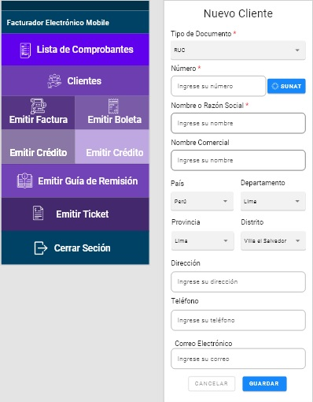
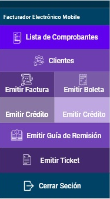
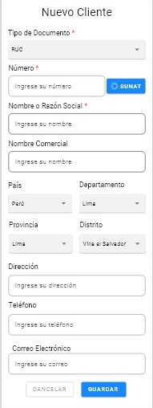

# AdobeXD.
Adobe XD es un editor de gráficos vectoriales desarrollado y publicado por Adobe Inc para diseñar y crear un prototipo de la experiencia del usuario para páginas web y aplicaciones móviles. El software está disponible para MacOS y Windows.

## Diseño para aplicacion movil (Solo una muestra).
Presentacion de diseño realizado con Adobe XD

### Diseño despues de logearce

### Diseño de algunas funciones que necesitaria la facturacion electronica

